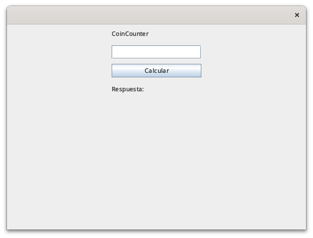
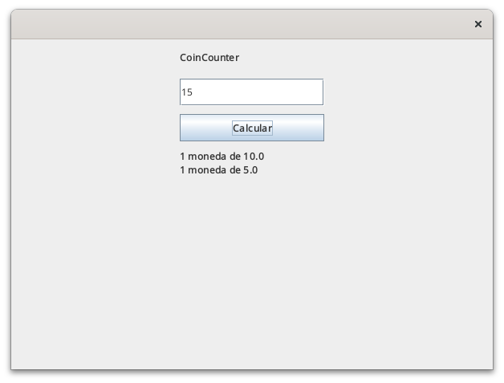
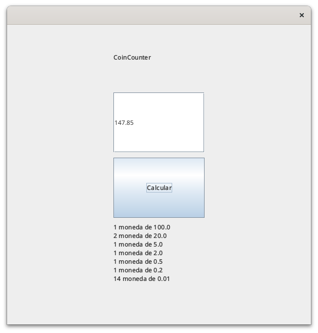
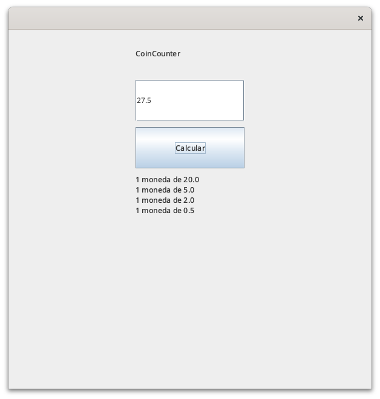

## TSU Desarrollo de Software Multiplataforma
## Daniel Ivan Escobar Vasquez
## Ruth Martinez Dominguez
## Estructura de Datos - 4F
## 15 de Septiembre del 2024

\pagebreak

# Contenido
1. [Creando la entrada a la aplicación](#creando-la-entrada-a-la-aplicación)
2. [Implementación del contador de monedas](#implementación-el-contador-de-monedas)


## Creando la entrada a la aplicación

Creamos la clase principal de nuestra aplicación. En ella ejecutamos el metodo RenderUI de la clase View. Instanciamos la clase CoinCounter y la usamos como parametro dentro del metodo createSingleInputView de la clase View.

```java
package com.example.app;

import com.example.app.View;

public class App {
    public static void main(String[] args) {
        View.RenderUi();
        CoinCounter coinCounter = new CoinCounter();
        View.createSingleInputView(coinCounter);
    }
}
```

La clase `CoinCounter` toma un argumento de tipo `double` paid, que representa el dinero al que intentaremos convertir en monedas, y un argumento de lista de double llamado numList, que representa la lista de denominaciones de monedas disponibles, y devuelve un `String` con la lista de monedas que representan el numero de la entrada paid.

```java
package com.example.app;

import java.util.ArrayList;
import java.util.List;

public class CoinCounter {

    public String calculate(double paid, List<Double> numList) {
        List<Double> denominations = new ArrayList<>(numList);
```
Bajo ciertas circunstancias eliminaremos elementos de la lista de denominaciones, hasta el punto de que la lista este vacía. De ser el caso, haremos un early return.

```java
        if(denominations.size() == 0){
            return "";
        }
```

Despues, creamos una variable de tipo `String` para guardar la salida del metodo.

```java
        String output = "";
```        

Ahora, si el dinero es diferente de cero, significa que tenemos que calcular las monedas que tenemos que devolver. Sino, significa que podemos hacer un early return.

```java
        if(paid != 0){
```

Despues de estar seguros que hay que calcular las monedas, nos preguntamos si la cantidad que tenemos es mayor o igual que la denominación más grande, que es la que tiene indice 0 en la lista de denominaciones.

En caso de ser mayor, calcularemos cuantas veces cabe una moneda de la denominación mayor en la cantidad que tenemos actualmente. Despues, a paid le restaremos la cantidad que podemos acumular con monedas de la actual denominación.

Finalmente, vamos a eliminar la denominación con la que estamos trabajando actualmente y volveremos a llamar la misma funcion, concatenando su salida con la actual.

```java     
            if (paid >= denominations.get(0)) {
                int coins = (int) (paid / denominations.get(0));
                output = output + coins + " moneda de " + denominations.get(0) + "<br>";
                paid = paid - (denominations.get(0) * coins);
            }

            denominations.remove(0);
            
            output = output + calculate(paid, denominations);
        }
        
        return output;
    }
}
```

Modificaremos cla clase SingleInputListener para que tome los dos argumentos que necesita nuestro metodo calculate. Esta forma de pasar la lista de denominaciones no es la ideal, pues en algun caso podriamos necesitar modificar esta lista en runtime. 

```java
    /* SingleInputListener.java */
    @Override
    public void actionPerformed(ActionEvent e) {
        // coinCounter.calculate(9, );
        answer.setText(
            "<html>" + 
            coinCounter.calculate(
                Double.parseDouble(inputField.getText()), 
                Arrays.asList(100.0, 50.0, 20.0, 10.0, 5.0, 2.0, 1.0, 0.5, 0.2, 0.01)
            ) +
            "</html>"
        );
    }
```
# Capturas del programa





